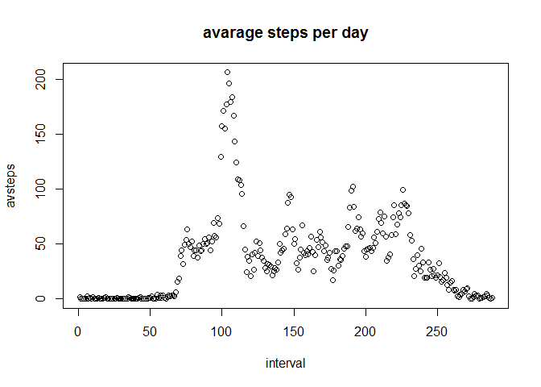
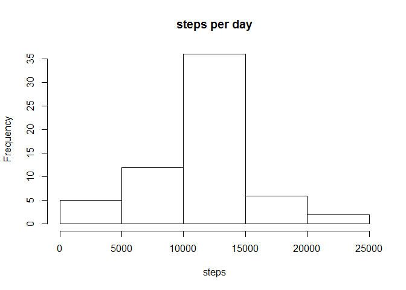
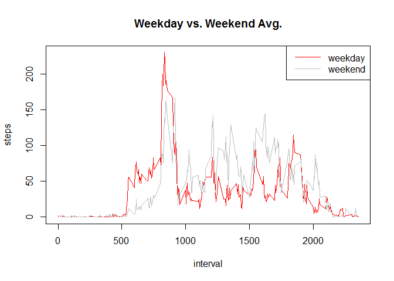

# Reproducable Research Peer Assignment 1
Roel Hogervorst  
Tuesday, December 02, 2014  
Reproducable Research Peer Assignment 1
============================================

##Loading and preprocessing the data
*First load the data,*
*Set data column in Date format.*

```r
data<-read.csv(unz("activity.zip", "activity.csv"))
#set date to Date format.
data$date<- as.Date(as.character(data$date), format="%Y-%m-%d")
```
##what is the toal number of steps taken per day? (W/o missing values)
1. Make a histogram of the total number of steps taken each day


```r
#sum values per day and make a histogram.
sums<-tapply(data$steps,data$date,sum, na.rm=TRUE)
hist(sums, xlab="steps", main="steps per day")
```

 
1. Calculate and report the mean and median total number of steps taken per day

```r
#calculate mean and median of total number of steps taken per day.
mean(sums)
```

```
## [1] 9354.23
```

```r
median(sums)
```

```
## [1] 10395
```

##What is the average daily activity pattern?
1. Make a time series plot (i.e. type = "l") of the 5-minute interval (x-axis) and the average number of steps taken, averaged across all days (y-axis)

```r
avsteps<-tapply(data$steps,data$interval,mean, na.rm=TRUE)
plot(avsteps, xlab="interval", main="avarage steps per day")
```

 

2. Which 5-minute interval, on average across all the days in the dataset, contains the maximum number of steps?

```r
which.max(avsteps)
```

```
## 835 
## 104
```

```r
avsteps["835"]
```

```
##      835 
## 206.1698
```

```r
avsteps["104"]
```

```
## <NA> 
##   NA
```
*It seems that the which.max function also counts NA as max. *
*5min segment 835 has the maximum number of avarage steps a day.*

##Imputing missing values
Note that there are a number of days/intervals where there are missing values (coded as NA). The presence of missing days may introduce bias into some calculations or summaries of the data.

1. Calculate and report the total number of missing values in the dataset (i.e. the total number of rows with NAs)

```r
sum(is.na(data$steps))
```

```
## [1] 2304
```

2. Devise a strategy for filling in all of the missing values in the dataset. The strategy does not need to be sophisticated. For example, you could use the mean/median for that day, or the mean for that 5-minute interval, etc.
*I will use a mean for every 5 minute interval imputation. This is of course a horrible way to impute missing data but let's use it anyway.*

3. Create a new dataset that is equal to the original dataset but with the missing data filled in.


```r
library(plyr)
data2<-ddply(data, .(interval), transform, steps=ifelse(is.na(steps),mean(steps, na.rm=TRUE), steps))
```


4. Make a histogram of the total number of steps taken each day and Calculate and report the mean and median total number of steps taken per day. 


```r
#sum values per day and make a histogram.
sums2<-tapply(data2$steps,data2$date,sum, na.rm=TRUE)
hist(sums2, xlab="steps", main="steps per day")
```

 


```r
#calculate mean and median of total number of steps taken per day.
mean(sums2)
```

```
## [1] 10766.19
```

```r
median(sums2)
```

```
## [1] 10766.19
```
Do these values differ from the estimates from the first part of the assignment? What is the impact of imputing missing data on the estimates of the total daily number of steps?
*yes both histograms and mean and median are different, by imputing the median per interval both the mean and median are larger*
*mean normal: 9354.23, and mean imputed:10766.19*
*median normal: 10395, and median imputed: 10766.19*

##Are there differences in activity patterns between weekdays and weekends?

1. For this part the weekdays() function may be of some help here. Use the dataset with the filled-in missing values for this part.

2. Create a new factor variable in the dataset with two levels – “weekday” and “weekend” indicating whether a given date is a weekday or weekend day.

```r
#I totally borrowed this from http://redheadedstepdata.io/a-few-simple-plots-in-r/ 
#I did think of building of a day variable but not the replacement loop.
data2$date <- as.Date(strptime(data2$date, format="%Y-%m-%d")) # convert date to a date() class variable  
data2$day <- weekdays(data2$date)                              # build a 'day' factor to hold weekday / weekend  
for (i in 1:nrow(data2)) {       # for each day                               
    if (data2[i,]$day %in% c("zaterdag","zondag")) {             # if Saturday or Sunday,
        data2[i,]$day<-"weekend"                                 #   then 'weekend'
    }
    else{
        data2[i,]$day<-"weekday"                                 #    else 'weekday'
    }
}
```
3. Make a panel plot containing a time series plot (i.e. type = "l") of the 5-minute interval (x-axis) and the average number of steps taken, averaged across all weekday days or weekend days (y-axis). See the README file in the GitHub repository to see an example of what this plot should look like using simulated data.


```r
#create aggrated data.
stepsByDay <- aggregate(data2$steps ~ data2$interval + data2$day, data2, mean)
names(stepsByDay) <- c("interval", "day", "steps")

## plot weekday over weekend time series
par(mfrow=c(1,1))  
with(stepsByDay, plot(steps ~ interval, type="n", main="Weekday vs. Weekend Avg."))  
with(stepsByDay[stepsByDay$day == "weekday",], lines(steps ~ interval, type="l", col="red"))  
with(stepsByDay[stepsByDay$day == "weekend",], lines(steps ~ interval, type="l", col="16" ))  
legend("topright", lty=c(1,1), col = c("red", "16"), legend = c("weekday", "weekend"), seg.len=3)
```

 
